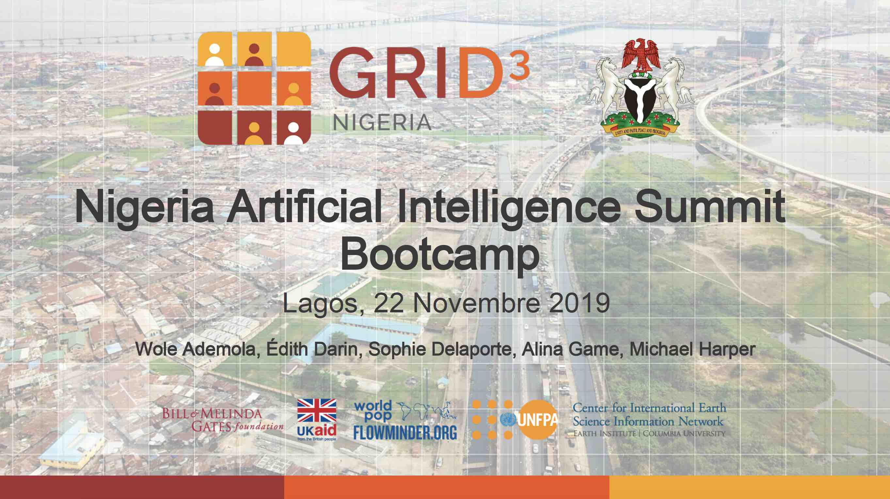

This repostiory provides an introduction of using the GRID3 spatial datasets for decision-making. The slides are available to view here: [PDF of slides](https://grid3.github.io/DSNTraining/AIBootcamp_Production%20and%20Use%20of%20Gridded%20Population%20data.pdf)

# Practical Exercises

Two R Markdown workbooks are provided to give examples of how population datasets can be used for analysis. These scripts are presented in R.

- [Practical 1](Practical_1/GeoprocessingForPopulationDataAnalysis.html)

This session provides an example of how we can use geoprocessing techniques to analyse population datasets. The aims of this exercise include:

1. Demonstrate how we can load datasets within R
2. Provide some quick visualisation examples to gain an understanding of the dataset
3. Demonstrate commonly used geospatial techniques for analysing population datasets.

These methods are designed to provide an introduction to the second workshop exercise, which will build on these techniques and demonstrate how we could do a larger analysis around this work.

- [Practical 2](Practical_2/AssessingHealthFacilitiesCoverage.html)

This session provides an example of how we can use GRID3 data within an application. We want to assess health facility coverage for maternal healthcare in Kaduna state. We are interested in finding out which areas are over-stretched with a high number of women of child-bearing age (WOCBA) per health-facility. By identifying a target number of people per health facility, we can begin to highlight locations that may need further invention. 

## Data Challenge 

**Which  problem can be solved with gridded population data?**

*What are we looking for*: 
- Code is not required, we are interested in the idea, but you should have an idea of how it could be implemented
- Could the idea have high impact? 
- Creativity is encouraged
- Is the idea achievable?

Think about more than just the data analysis. How might your data analysis support decision-makers? Who are the stakeholders?

[Submission](https://docs.google.com/forms/d/e/1FAIpQLSfoU0vA9liOgjxY1wQ57AYraWGHtQYdecZvuUEyZYQtzvAZLQ/viewform)
